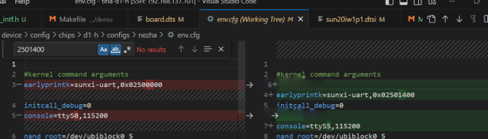
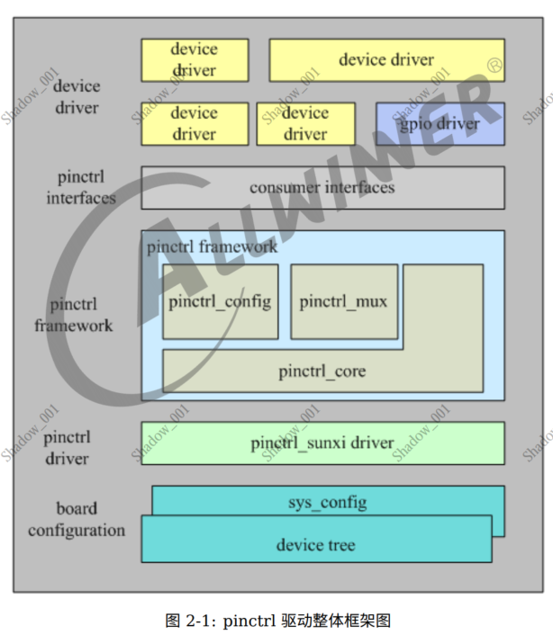
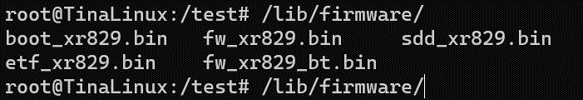

# SmartNetConnect

基于全志哪吒平台（国产）的设备自动发现与多协议通信

实现基于NFC的设备发现、组网与通信
- 配网流程大概4.5s
- 
实现基于BLE的设备发现、组网与通信
- 配网时间大概3s
- 


需要修改linux源码，编译
- 设备树
- dts
- pin multiplex
- GPIO

根据BLE spec使用代码对BLE进行配置
- Advertising Parameters
- Scan Response Data
- Advertising_interval_Min

## 内容

- 进行NFC驱动适配，使其支持NFC拓展芯片

  - 支持UART、I2C、SPI接口驱动适配与通信

- 简化手动配网流程，实现设备间基于NFC “碰一碰”的配网与网络通信

- 进行BLE驱动适配，使其支持BLE功能
  - 实现基于BLE的设备组网与通信

## 流程


- 使用特定key在特定block写入数据的Mifare Classic Card


## NFC-UART


### 设备树修改

硬件细节由设备树传递给Linux避免大量冗余代码

描述硬件的数据结构


- uboot手动改
- 改dts、dtsi，编译
- 动态设备树


### pin


### console



### inittab


## NFC-I2C
### GPIO控制

- 内核空间方法
  - API、直接控制寄存器
- 用户空间方法
  - sysfs interface、mmap




### GPIO中断

## BLE

可以直接使用

可通过bluez库、hciconfig、hcitool等工具进行配置

```bash
hcitool -i hci0 cmd 0x08 0x0009 18 0D 09 6A 75 73 74 2D 73 74 6F 70 2D 69 74 09 20 11 22 33 44 55 66 77 88 00 00 00 00 00 00 00
hcitool -i hci0 cmd 0x08 0x0006 20 00 20 00 00 00 00 00 00 00 00 00 00 07 00
hcitool -i hci0 cmd 0x08 0x000A 01

```


### 开启
`hciattach -n ttyS1 xradio > /dev/null 2>&1 &`
- 打开指定的串口设备文件
- 根据指定的波特率设置串口参数
- 将蓝牙控制器的初始化数据加载到内核中 ( 固件文件、特定的 HCI 命令等) 
- 启动蓝牙控制器，进入适当的工作模式
- 等待蓝牙控制器与主机控制器接口建立通信
- 可以开始接收和发送蓝牙数据





## 踩坑
### 多线程同步
WIFI、BLE的连接callback function的执行环境是操作系统管理，独立的线程

多线程变量可见性、一致性问题


**解决**

- Volatile
  - 通知编译器和运行时环境，每次读取变量时从内存中取最新值 
- Mutex
  - 确保一个线程同时读、修改
  


### inittab


在该终端设备上显示一个提示，等待用户输入


- 在引导过程中由 init 进程读取

- 根据其中的配置来启动系统中的各个进程。

- 定义了在系统引导过程中需要启动的各个运行级别（runlevel）以及与每个运行级别关联的进程。

- 每个运行级别定义了一组需要启动或停止的进程


